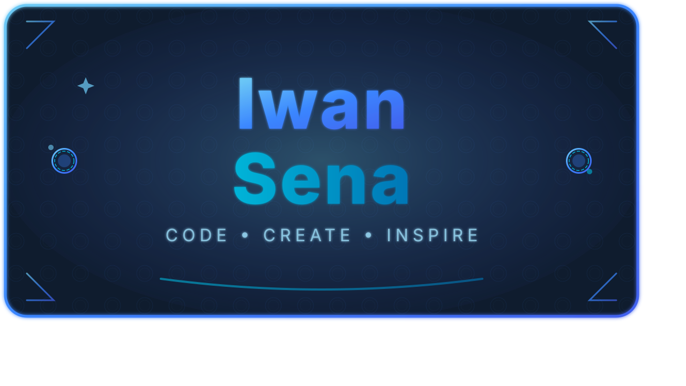

<!-- ===================================================== -->
<!--              IWAN SENA — GITHUB PROFILE               -->
<!-- ===================================================== -->

  <!-- Replace with your logo URL -->
  

<h1 align="center">Hi, I’m Iwan Sena 👋</h1>

  <strong>Builder of browser engines, open-source ecosystems, and digital archives.</strong> 
  Exploring the intersection of legacy systems, modern engineering, and human-centered software.

  
  
  

---

## 🧑‍💻 About Me

I believe every human being lives with dreams and hopes.  
But dreams mean nothing if we are afraid to ask questions, afraid to move forward, or afraid to truly understand ourselves and others.

Knowledge without ethics leads people astray.  
Confidence without humility blinds judgment.  
And strength without purpose becomes meaningless.

There is an old proverb from ancient Chinese wartime philosophy:

> *“Even if a thousand arrows come from all directions and cavalry surrounds you for seven nights,  
> as long as there is spirit, hope, and will — there will always be a path forward,  
> though it may demand sacrifice.”*

I am not here to claim greatness.  
I am here to learn, to build, and to preserve meaning in technology.

Hello — this is Sena.

---

## 🧠 Tech Stack & Interests

  

- **Primary:** JavaScript, Node.js, HTML/CSS  
- **Systems & Native:** C++20, Rust (learning & experimentation)  
- **Platform:** Android, Linux  
- **Interests:** Browser engines, offline-first systems, legacy web technology, documentation

---

## 🚀 Featured & Pinned Projects

### 🌀 EndSiena Browser
A hybrid mobile browser built with a **Cyborg Architecture**, combining retro web foundations with modern mobile engineering.

🔗 Repository:  
https://github.com/IwanSena/Endsiena

---

### 🌍 Upam Global  
**Universal Portable Admin Manager** — a flexible and extensible administration ecosystem.

🔗 Repository:  
https://github.com/IwanSena/Upam-Global

---

## 📊 GitHub Stats

  

  

  

---

## 🎵 Now Playing / Personal Vibe

- 🎧 Favorite Band: **Scorpions**
- 🎸 Genre: Rock, Classic Rock, Instrumental
- 💭 Coding feels better with music that has history and soul.

---

## 💬 Quote of the Day

> *“Technology should not erase memories.  
> It should preserve them — and make them accessible for the future.”*

---

## 💖 Support My Work

If you find my work meaningful and want to support open-source development:

  
  
  
  
  

- WebMoney / Visa / MasterCard: https://funding.webmoney.com/donasi/donate  
- Ko-fi: https://ko-fi.com/iwansena  
- PayPal: https://paypal.me/IwanSena  
- Trakteer: https://trakteer.id/iwansena/gift  
- Crypto (All): https://pay.web.money/d/dxzq  

---

## 📫 Contact & Links

- 📧 Email: dev.iwansena@gmail.com  
- 🌐 Website: *(Coming soon)*  
- 💼 LinkedIn: https://www.linkedin.com/in/iwansena  
- 💬 Telegram: https://t.me/Aliansiena  
- 📄 GitHub Pages: https://iwansena.github.io/IwanSena/  

---

  Thank you for visiting my profile. 
  May your code be meaningful and your systems timeless.

---

### 🎤 Stand-up Joke (Signature)

> I like JavaScript…  
> but instead of coding JS, sometimes it’s better to sleep.  
> Because JavaScript is not a friend —  
> so why invite it to bed? 😄
